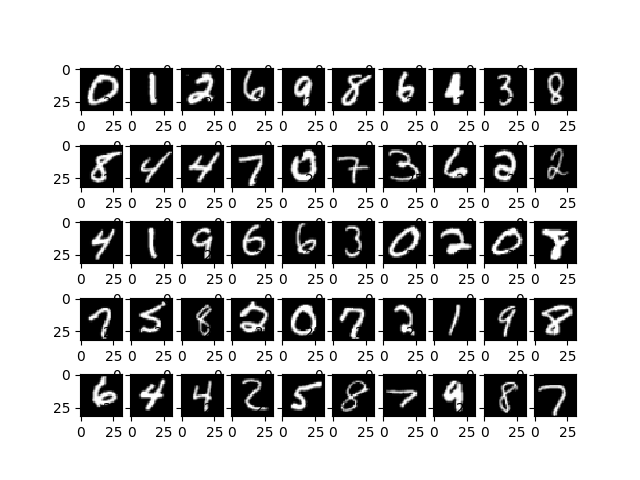

# BEGAN Auto Encoder

The autoencoder implemented is based on the one published by the BEGAN research paper.

## Getting Started

1. `git clone ` + repo URL
2. cd to repo
3. `pip install tensorflow` if package is not yet installed
4. Train model: `python simple_autoencoder.py` 

## Results

Input images:

Reconstructed images:

## Built With

* [Tensoflow](https://www.tensorflow.org) - Software library for numerical computation using data flow graphs
* [Matplotlib](https://matplotlib.org) - Python 2D plotting library
* [Numpy](http://www.numpy.org) - Package for scientific computing
* [skimage](http://scikit-image.org/docs/dev/api/skimage.transform.html) - Image Processing SciKit

## Contributing

1. Fork it! Star it?
2. Create your feature branch: `git checkout -b my-new-feature`
3. Commit your changes: `git commit -am 'Add some feature'`
4. Push to the branch: `git push origin my-new-feature`
5. Submit a pull request :D

## Acknowledgments

* **Hadi Kazemi** - *Boiler plate* - [Repo](https://github.com/hadikazemi)
* BEGAN: Boundary Equilibrium Generative Adversarial Networks - [arXiv](https://arxiv.org/abs/1703.10717)